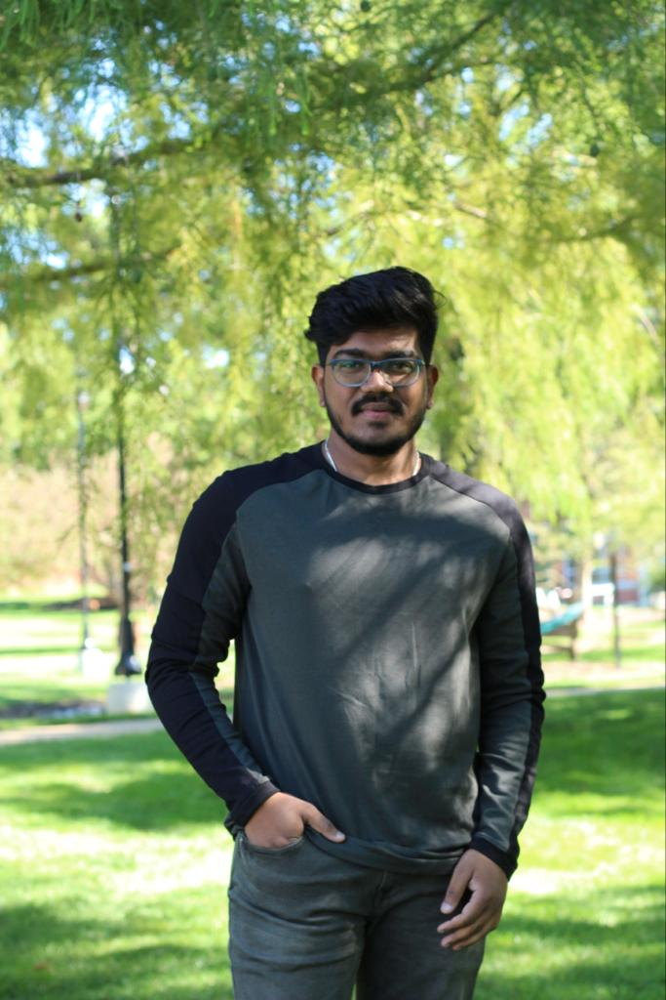

# LAKSHMI SAI TEJA PADAM

I am Sai Teja. I am a friendly person. I like to play cricket,badminton,etc. I love to ride bikes and cars.
I am undergraduated from computer science and engineering and now currently doing masters in Applied Computer science from Northwest Missouri State University.

****

## SPORTS:
Sports can help you reach your fitness goals and maintain a healthy weight. However, they also encourage healthy decision-making such as not smoking and not drinking. Sports also have hidden health benefits such as lowering the chance of osteoporosis or breast cancer later in life.

|NAME|REASON|NO OF HOURS|
|----|------|-----------|
|CRICKET|FITNESS|2|
|TENNIS|MUSCLE CONTRACTIONS|2|
|BADMINTON|FOCUS|3|
|FOOTBALL|STAMINA|1|

